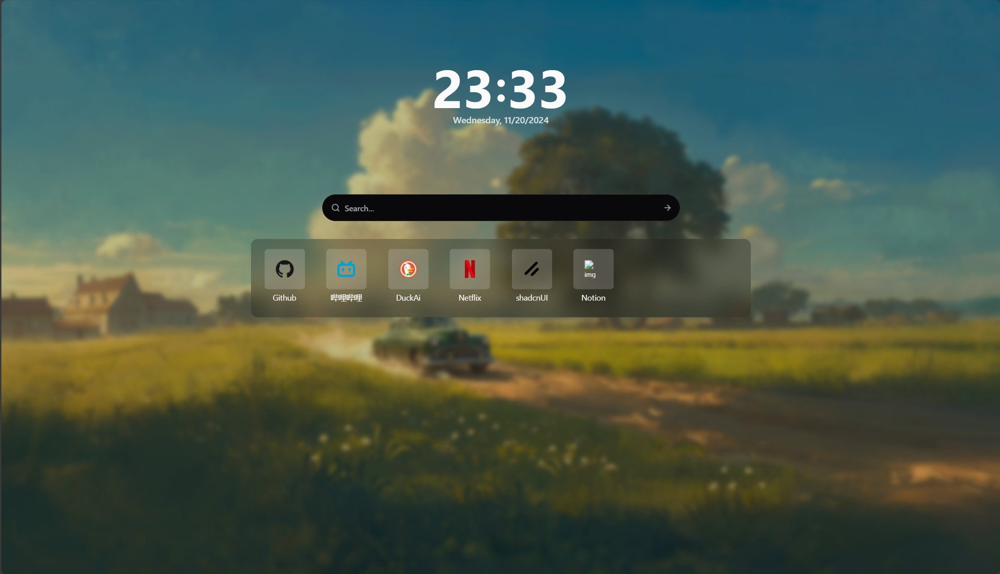

<div align="center">

<h1>Simple Start</h1>

<p>一个简洁、现代化的浏览器起始页扩展</p>


[English](./README_EN.md) | 简体中文

</div>

---

## 📖 项目简介

**Simple Start** 是一个功能丰富的浏览器新标签页扩展，专为提升浏览效率而设计。采用 React、TypeScript 和 Vite 构建，提供流畅的用户体验和强大的自定义功能。

### ✨ 核心功能

- ⏰ **时钟显示**：大号时钟显示，一目了然当前时间和日期
- 🔍 **快速搜索**：集成搜索框，支持快捷键 `Alt+K` 快速聚焦
- 🔗 **快捷链接管理**：自定义常用网站卡片，支持拖拽排序
- 📜 **历史记录建议**：智能展示最近访问的网页
- 🎨 **自定义壁纸**：设置您喜欢的背景图片
- 🌓 **明暗主题切换**：支持亮色/暗色主题自动切换
- 📋 **命令面板**：快速执行各种操作
  - 搜索历史记录
  - 标签页搜索
  - 网页搜索
  - 协议跳转支持
- 💧 **喝水提醒**：通过 MQTT 接收健康提醒（可选功能）
- 📤 **数据导入导出**：备份和恢复您的设置与数据

### 📸 界面预览



### 🚧 开发状态

该项目正在积极开发中，持续添加新功能并优化用户体验。

### 🛠️ 技术栈

- **React 18** - UI 框架
- **TypeScript** - 类型安全开发
- **Vite** - 快速构建工具
- **TailwindCSS** - 样式框架
- **pnpm** - 包管理器
- **Chrome Extension Manifest V3** - 扩展标准

### 📦 安装使用

#### 方式一：从源码构建（推荐开发者）

```bash
# 克隆仓库
git clone https://github.com/N0I0C0K/simple-start.git
cd simple-start

# 安装依赖（需要 Node.js >= 18.19.1 和 pnpm）
pnpm install

# 开发模式（Chrome）
pnpm dev

# 开发模式（Firefox）
pnpm dev:firefox

# 构建生产版本（Chrome）
pnpm build

# 构建生产版本（Firefox）
pnpm build:firefox

# 打包为 zip
pnpm zip
```

#### 方式二：加载到浏览器

1. 构建完成后，在浏览器中打开扩展管理页面：
   - **Chrome**：访问 `chrome://extensions`
   - **Firefox**：访问 `about:debugging#/runtime/this-firefox`
2. 启用"开发者模式"（Chrome）
3. 点击"加载已解压的扩展程序"（Chrome）或"临时加载附加组件"（Firefox）
4. 选择 `dist` 目录

### 🔧 开发命令

```bash
# 类型检查
pnpm type-check

# 代码检查和修复
pnpm lint
pnpm lint:fix

# 代码格式化
pnpm prettier

# 清理构建产物
pnpm clean:bundle

# 完全清理（包括依赖）
pnpm clean

# 端到端测试
pnpm e2e
```

### 📝 项目结构

```
simple-start/
├── chrome-extension/     # Chrome 扩展配置
├── packages/
│   ├── storage/         # 数据存储层
│   ├── ui/              # UI 组件库
│   ├── i18n/            # 国际化
│   ├── shared/          # 共享工具
│   └── hmr/             # 热重载
├── pages/
│   ├── new-tab/         # 新标签页（主页面）
│   ├── popup/           # 弹出窗口
│   ├── options/         # 设置页面
│   └── ...
└── tests/               # 测试文件
```

### ⚙️ 功能配置

扩展提供丰富的配置选项，点击右上角设置按钮可进行：

- **历史记录建议**：开启/关闭历史记录展示
- **命令输入自动聚焦**：新标签页自动聚焦搜索框
- **自定义壁纸**：设置背景图片 URL
- **MQTT 远程控制**：配置 MQTT 服务器实现跨设备提醒
- **数据管理**：导出/导入配置和书签数据

### 🤝 参与贡献

欢迎提交 Issue 和 Pull Request！

### 📄 开源许可

本项目采用 MIT 许可证 - 详见 [LICENSE](LICENSE) 文件。

### 🙏 致谢

本项目基于 [chrome-extension-boilerplate-react-vite](https://github.com/Jonghakseo/chrome-extension-boilerplate-react-vite) 开发。

---
